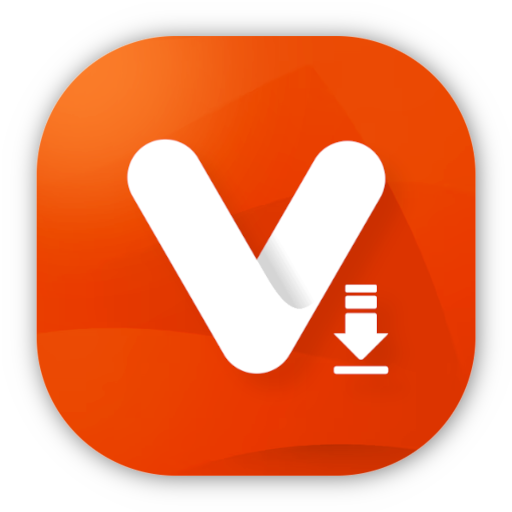
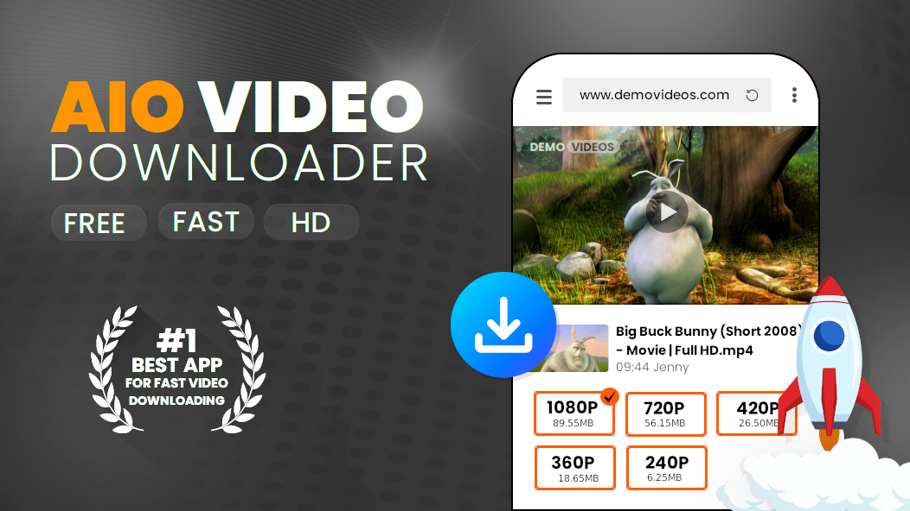
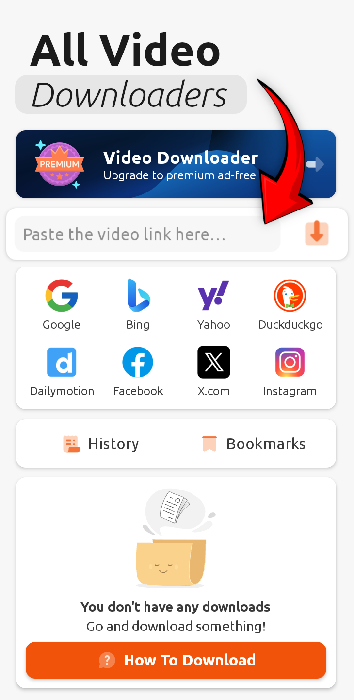
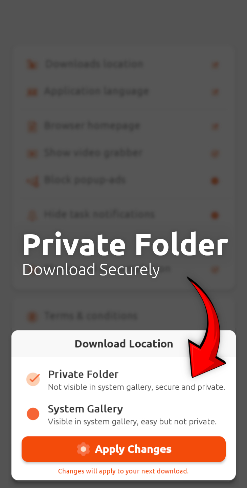
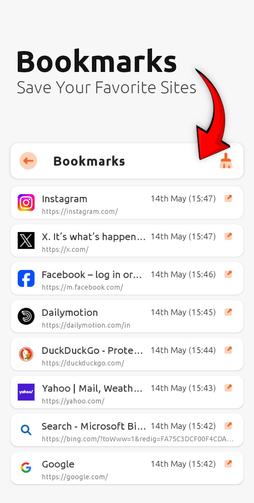

<div align="center">


# AIO Video Downloader

### 📥 Powerful Video/Audio Downloader for Android — Open Source, Ad-Free, and Built on yt-dlp for a Seamless, User-Centric Experience

[](https://github.com/shibafoss/AIO-Video-Downloader/blob/main/CHANGELOG.md)
[](https://github.com/shibafoss/AIO-Video-Downloader/releases/)


</div>

## 📌 Introduction

AIO Video Downloader is a clean, open-source Android application designed as an alternative to VidMate and
SnapTube, offering a simplified yet powerful video downloading experience. Developed in India with
privacy and user experience in mind, AIO Video Downloader removes all the clutter and ads found in similar apps
while maintaining all the essential features.

Built on the robust **[yt-dlp](https://github.com/yt-dlp/yt-dlp)** backend with the help
of [youtubedl-android](https://github.com/yausername/youtubedl-android), AIO Video Downloader supports
downloading from **1000+ websites** including YouTube, Facebook, Instagram, Twitter, Dailymotion,
and many more. Enjoy your favorite videos offline without compromising on quality or dealing with
intrusive advertisements.

## 📱 Screenshots

<div align="center">
<div>



</div>
</div>

## ✨ Key Features

- **1000+ Website Support**: Thanks to yt-dlp backend, download from virtually any video platform
- **Clean & Intuitive UI**: Simple interface focused on what matters - finding and downloading
  content
- **No Ads**: Completely ad-free experience
- **Multiple Resolutions**: Download videos in various qualities (up to 4K where available)
- **Audio Extraction**: Save videos as MP3 audio files
- **Batch Downloads**: Queue multiple downloads at once
- **Background Downloads**: Continue using your device while downloads complete
- **Download Manager**: Pause, resume, or cancel downloads
- **Dark/Light Theme**: Choose your preferred appearance
- **Built-in Browser**: Securely browse supported sites within the app
- **Open Source**: Transparent codebase you can audit and contribute to
- **Made in India**: Developed with pride by Indian developers

## 📥 Installation

AIO Video Downloader is available in two ways:

### 1. Official Releases (Recommended)

Download the latest APK from our **[GitHub Releases page](https://github.com/shibaFoss/AIO-Video-Downloader/releases/)** Or
straight [Download the lastest apk here](https://github.com/shibaFoss/AIO-Video-Downloader/releases/download/20250729v2/AIO_version_20250729-arm64-v8a-release.apk)

### 2. Build from Source

For developers who want to build the app themselves:

```bash
git clone https://github.com/shibafoss/AIO-Video-Downloader.git
cd AIO Video Downloader
./gradlew assembleDebug
```

The APK will be generated in `app/build/outputs/apk/debug/`

## 🛠️ Technology Stack

- **Backend**: [youtubedl-android-wrapper](https://github.com/yausername/youtubedl-android) - The
  most powerful video downloader engine
- **Frontend**: Native Android (Kotlin/Java)
- **Architecture**: MVVM (Model-View-ViewModel)
- **Database**: ObjectBox Library
- **Networking**: Retrofit + OkHttp

## 🌟 Why Choose AIO Video Downloader Over Alternatives?

| Feature         | AIO | VidMate | SnapTube |
|-----------------|-----|---------|----------|
| Open Source     | ✅ Yes | ❌ No    | ❌ No     |
| Ad-Free         | ✅ Yes | ❌ No    | ❌ No     |
| Privacy Focused | ✅ Yes | ❌ No    | ❌ No     |
| 1000+ Sites     | ✅ Yes | ✅ Yes   | ✅ Yes    |
| Lightweight     | ✅ Yes | ✅ Yes   | ✅ Yes    |
| Customizable    | ✅ Yes | ✅ Yes   | ✅ Yes    |
| Transparent     | ✅ Yes | ❌ No    | ❌ No     |

## 🤝 Contributing

We welcome contributions from the open-source community! Here's how you can help:

1. **Code Contributions**: Fork the repository, make your changes, and submit a pull request
2. **Bug Reports**: Open an issue if you find any bugs
3. **Feature Requests**: Suggest new features or improvements
4. **Documentation**: Help improve documentation or translations
5. **Testing**: Test the app and report any issues

Please read our [Contribution Guidelines](CONTRIBUTING.md) before getting started.

## 📜 License

AIO Video Downloader is released under the **GNU AFFERO GENERAL PUBLIC LICENSE**. See [LICENSE](LICENSE) for
full details.

## 📞 Contact & Support

For support, feature requests, or general inquiries:

- **GitHub Issues**: [Open an issue](https://github.com/shibafoss/AIO-Video-Downloader/issues)
- **Email**: shiba.spj@hotmail.com

## 🙏 Acknowledgments

- The **[yt-dlp](https://github.com/yt-dlp/yt-dlp)** team for their incredible work
- All our contributors and testers
- The open-source community for inspiration and support

---

**Made with ❤️ in India** 🇮🇳

*AIO Video Downloader is not affiliated with VidMate, SnapTube, or any other proprietary video downloader.*