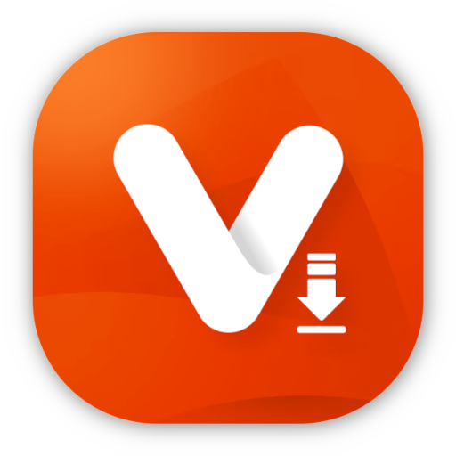
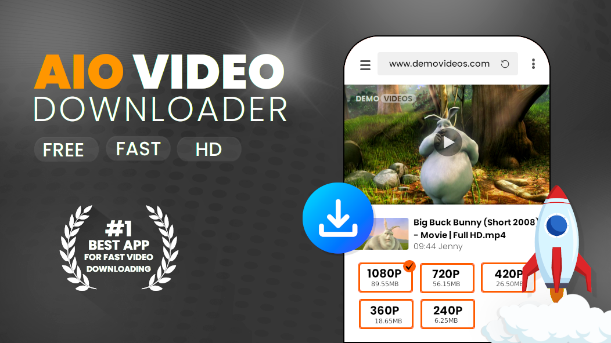
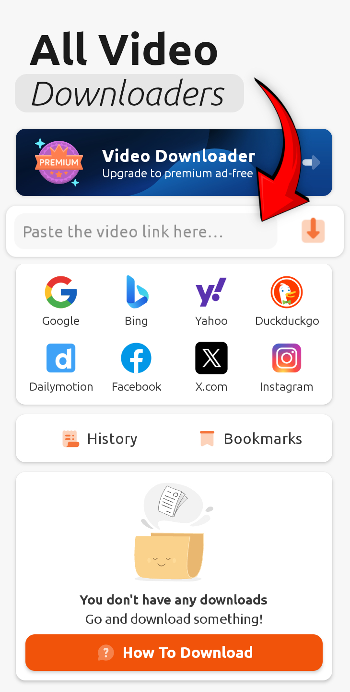
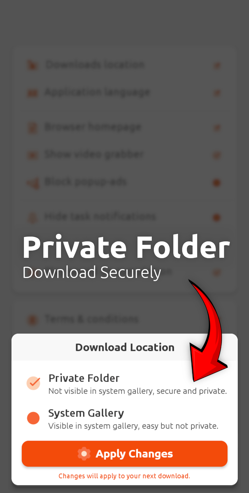
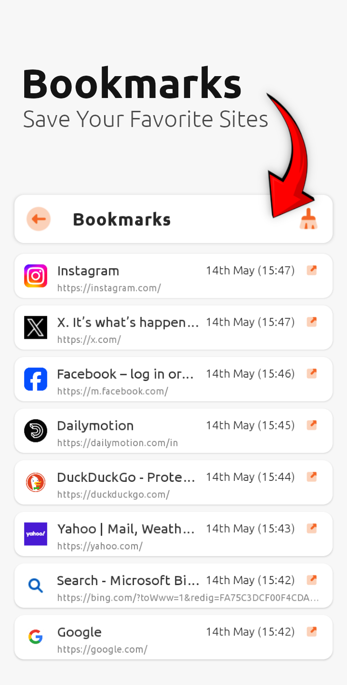

  

    
🌐 Language

    

      

        <a href="https://openaitx.github.io/view.html?user=shibaFoss&project=AIO-Video-Downloader&lang=en">English</a>
        | <a href="https://openaitx.github.io/view.html?user=shibaFoss&project=AIO-Video-Downloader&lang=zh-CN">简体中文</a>
        | <a href="https://openaitx.github.io/view.html?user=shibaFoss&project=AIO-Video-Downloader&lang=zh-TW">繁體中文</a>
        | <a href="https://openaitx.github.io/view.html?user=shibaFoss&project=AIO-Video-Downloader&lang=ja">日本語</a>
        | <a href="https://openaitx.github.io/view.html?user=shibaFoss&project=AIO-Video-Downloader&lang=ko">한국어</a>
        | <a href="https://openaitx.github.io/view.html?user=shibaFoss&project=AIO-Video-Downloader&lang=hi">हिन्दी</a>
        | <a href="https://openaitx.github.io/view.html?user=shibaFoss&project=AIO-Video-Downloader&lang=th">ไทย</a>
        | <a href="https://openaitx.github.io/view.html?user=shibaFoss&project=AIO-Video-Downloader&lang=fr">Français</a>
        | <a href="https://openaitx.github.io/view.html?user=shibaFoss&project=AIO-Video-Downloader&lang=de">Deutsch</a>
        | <a href="https://openaitx.github.io/view.html?user=shibaFoss&project=AIO-Video-Downloader&lang=es">Español</a>
        | <a href="https://openaitx.github.io/view.html?user=shibaFoss&project=AIO-Video-Downloader&lang=it">Italiano</a>
        | <a href="https://openaitx.github.io/view.html?user=shibaFoss&project=AIO-Video-Downloader&lang=ru">Русский</a>
        | <a href="https://openaitx.github.io/view.html?user=shibaFoss&project=AIO-Video-Downloader&lang=pt">Português</a>
        | <a href="https://openaitx.github.io/view.html?user=shibaFoss&project=AIO-Video-Downloader&lang=nl">Nederlands</a>
        | <a href="https://openaitx.github.io/view.html?user=shibaFoss&project=AIO-Video-Downloader&lang=pl">Polski</a>
        | <a href="https://openaitx.github.io/view.html?user=shibaFoss&project=AIO-Video-Downloader&lang=ar">العربية</a>
        | <a href="https://openaitx.github.io/view.html?user=shibaFoss&project=AIO-Video-Downloader&lang=fa">فارسی</a>
        | <a href="https://openaitx.github.io/view.html?user=shibaFoss&project=AIO-Video-Downloader&lang=tr">Türkçe</a>
        | <a href="https://openaitx.github.io/view.html?user=shibaFoss&project=AIO-Video-Downloader&lang=vi">Tiếng Việt</a>
        | <a href="https://openaitx.github.io/view.html?user=shibaFoss&project=AIO-Video-Downloader&lang=id">Bahasa Indonesia</a>
        | <a href="https://openaitx.github.io/view.html?user=shibaFoss&project=AIO-Video-Downloader&lang=as">অসমীয়া</
      

    

  

# AIO Video Downloader

### 🚀 All-in-One Video Solution: Download, Play, Protect - Simple, Fast & Private

----

## 📌 Introduction

**AIO Video Downloader** is your ultimate all-in-one media companion - combining powerful video downloading, a full-featured video player, and secure private file protection in one simple, elegant app.

Built on the robust **[yt-dlp](https://github.com/yt-dlp/yt-dlp)** engine, AIO delivers **super-fast download speeds** and can grab virtually any video that plays online. With support for **1000+ websites**, you'll never miss your favorite content again.

No more switching between multiple apps - download, play, and protect your media files all in one place!

## 📱 Screenshots

## ✨ Key Features

### 🎯 **Simple & Intuitive**
- **Clean, User-Friendly Interface**: No complicated menus or confusing options
- **One-Tap Downloads**: Grab videos with a single click
- **Smart Suggestions**: Automatically detects downloadable content
- **Easy File Management**: Organize your downloads effortlessly

### ⚡ **Super Fast Downloads**
- **Lightning-First Speed**: Optimized download engine for maximum speed
- **Multi-Connection Downloads**: Faster downloads using parallel connections
- **Background Processing**: Continue using your phone while downloading
- **Resume Support**: Never lose progress with resume capability

### 🎬 **Full-Featured Video Player**
- **Built-in Media Player**: Play your downloads instantly without leaving the app
- **Multiple Format Support**: MP4, MKV, AVI, 3GP, and more
- **Hardware Acceleration**: Smooth playback for HD and 4K videos
- **Playback Controls**: Gesture controls, brightness, volume, and seek
- **Background Play**: Keep audio playing while using other apps
- **Subtitle Support**: Load external subtitle files
- **Playlist Management**: Create and manage video playlists

### 🔒 **Private File Lock**
- **Secure Private Folder**: Hide sensitive videos and files from gallery
- **App-Locked Storage**: Protected by app security - only accessible within AIO
- **Move Files Privately**: Easily move downloads between gallery and private storage
- **Privacy Protection**: Keep personal content away from prying eyes
- **No System Permissions**: Private folder doesn't require special permissions

### 🌐 **Universal Video Grabber**
- **1000+ Websites Supported**: YouTube, Instagram, Facebook, Twitter, TikTok, and countless more
- **Virtually Any Online Video**: If it plays in your browser, you can download it
- **Auto-Detection**: Smart recognition of video content on webpages
- **Built-in Browser**: Secure browsing within the app
- **Custom Headers**: Support for sites requiring login or special headers

### 🎵 **Audio & Video Flexibility**
- **Multiple Quality Options**: 144p to 4K (when available)
- **Audio Extraction**: Save videos as MP3 audio files
- **Format Selection**: Choose your preferred video/audio format
- **Batch Downloads**: Queue multiple videos at once

### 🛡️ **Safe & Transparent**
- **No Ads**: Completely ad-free experience
- **Open Source**: Transparent codebase you can audit and trust
- **No Tracking**: We don't collect your personal data
- **Regular Updates**: Continuous improvements and new features

### 📁 **Smart File Management**
- **Download Manager**: Pause, resume, or cancel downloads
- **Organized Library**: Automatic sorting by date, name, or size
- **Storage Management**: Monitor and manage your device storage
- **Quick Search**: Find your downloads instantly

---

## 🚀 How to Use

1. **Download**: Copy any video URL or use the built-in browser
2. **Grab**: AIO automatically detects downloadable content
3. **Choose**: Select your preferred quality and format
4. **Download**: Enjoy super-fast download speeds
5. **Play**: Use the built-in player or move to private storage

## 🔧 Technical Details

- **Backend**: Powered by yt-dlp with youtubedl-android integration
- **Platform**: Android 8.0+ (Oreo and above)
- **Architecture**: Modern Android development with Kotlin
- **License**: Open Source - Custom License

---

**Made with ❤️ in India** 🇮🇳

*AIO Video Downloader is not affiliated with any proprietary video downloader apps. We believe in open, transparent software that respects your privacy.*
